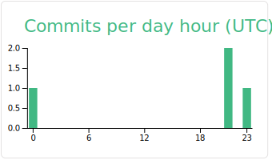

# My Profile

   <code>Visitor count</code>
   
  
    
    
    
   <a href="https://profile-summary-for-github.com/user/DucTrungNguyen">https://profile-summary-for-github.com/user/DucTrungNguyen</a>
 

  
### Github Stats

<!--  -->

# Others

