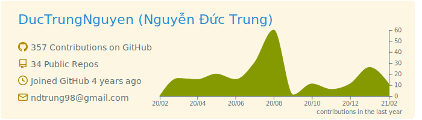
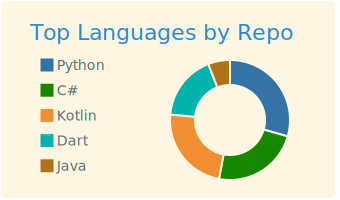
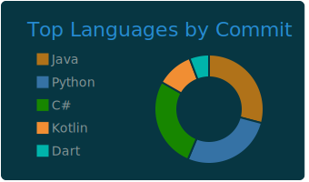
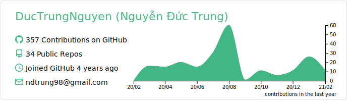
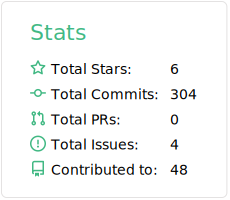
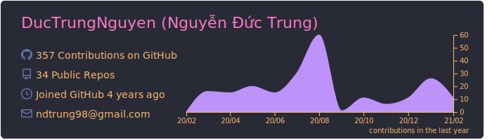
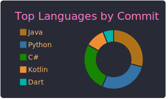
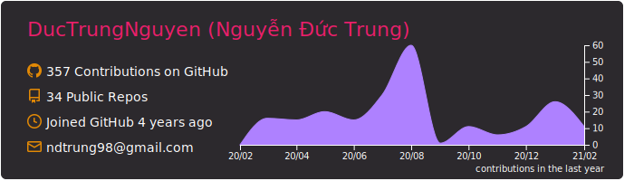
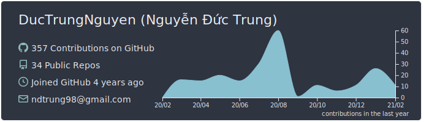

# Preview Cards

Here are all cards with themes.
| :warning: | If your workflow does not generate all cards in output folder, then you need to use [Personal access token](https://docs.github.com/en/actions/configuring-and-managing-workflows/creating-and-storing-encrypted-secrets) instead of GITHUB_TOKEN in workflow. |
| :-------: | :------------------------------------------------------------------------------------------------------------------------------------------------------------------------------------------------------------------------------------------------ |

[Personal token need those permission](https://github.com/vn7n24fzkq/github-profile-summary-cards/wiki/Personal-access-token-permissions)


### default


```
[](https://github.com/vn7n24fzkq/github-profile-summary-cards)
```


```
[](https://github.com/vn7n24fzkq/github-profile-summary-cards)
```


```
[](https://github.com/vn7n24fzkq/github-profile-summary-cards)
```


```
[](https://github.com/vn7n24fzkq/github-profile-summary-cards)
```


```
[](https://github.com/vn7n24fzkq/github-profile-summary-cards)
```


### solarized


```
[](https://github.com/vn7n24fzkq/github-profile-summary-cards)
```


```
[](https://github.com/vn7n24fzkq/github-profile-summary-cards)
```


```
[](https://github.com/vn7n24fzkq/github-profile-summary-cards)
```


```
[](https://github.com/vn7n24fzkq/github-profile-summary-cards)
```


```
[](https://github.com/vn7n24fzkq/github-profile-summary-cards)
```


### solarized_dark


```
[](https://github.com/vn7n24fzkq/github-profile-summary-cards)
```


```
[](https://github.com/vn7n24fzkq/github-profile-summary-cards)
```


```
[](https://github.com/vn7n24fzkq/github-profile-summary-cards)
```


```
[](https://github.com/vn7n24fzkq/github-profile-summary-cards)
```


```
[](https://github.com/vn7n24fzkq/github-profile-summary-cards)
```


### vue


```
[](https://github.com/vn7n24fzkq/github-profile-summary-cards)
```


```
[](https://github.com/vn7n24fzkq/github-profile-summary-cards)
```


```
[](https://github.com/vn7n24fzkq/github-profile-summary-cards)
```


```
[](https://github.com/vn7n24fzkq/github-profile-summary-cards)
```


```
[](https://github.com/vn7n24fzkq/github-profile-summary-cards)
```


### dracula


```
[](https://github.com/vn7n24fzkq/github-profile-summary-cards)
```


```
[](https://github.com/vn7n24fzkq/github-profile-summary-cards)
```


```
[](https://github.com/vn7n24fzkq/github-profile-summary-cards)
```


```
[](https://github.com/vn7n24fzkq/github-profile-summary-cards)
```


```
[](https://github.com/vn7n24fzkq/github-profile-summary-cards)
```


### monokai


```
[](https://github.com/vn7n24fzkq/github-profile-summary-cards)
```


```
[](https://github.com/vn7n24fzkq/github-profile-summary-cards)
```


```
[](https://github.com/vn7n24fzkq/github-profile-summary-cards)
```


```
[](https://github.com/vn7n24fzkq/github-profile-summary-cards)
```


```
[](https://github.com/vn7n24fzkq/github-profile-summary-cards)
```


### nord_bright


```
[](https://github.com/vn7n24fzkq/github-profile-summary-cards)
```


```
[](https://github.com/vn7n24fzkq/github-profile-summary-cards)
```


```
[](https://github.com/vn7n24fzkq/github-profile-summary-cards)
```


```
[](https://github.com/vn7n24fzkq/github-profile-summary-cards)
```


```
[](https://github.com/vn7n24fzkq/github-profile-summary-cards)
```


### nord_dark


```
[](https://github.com/vn7n24fzkq/github-profile-summary-cards)
```


```
[](https://github.com/vn7n24fzkq/github-profile-summary-cards)
```


```
[](https://github.com/vn7n24fzkq/github-profile-summary-cards)
```


```
[](https://github.com/vn7n24fzkq/github-profile-summary-cards)
```


```
[](https://github.com/vn7n24fzkq/github-profile-summary-cards)
```


### github


```
[](https://github.com/vn7n24fzkq/github-profile-summary-cards)
```


```
[](https://github.com/vn7n24fzkq/github-profile-summary-cards)
```


```
[](https://github.com/vn7n24fzkq/github-profile-summary-cards)
```


```
[](https://github.com/vn7n24fzkq/github-profile-summary-cards)
```


```
[](https://github.com/vn7n24fzkq/github-profile-summary-cards)
```


